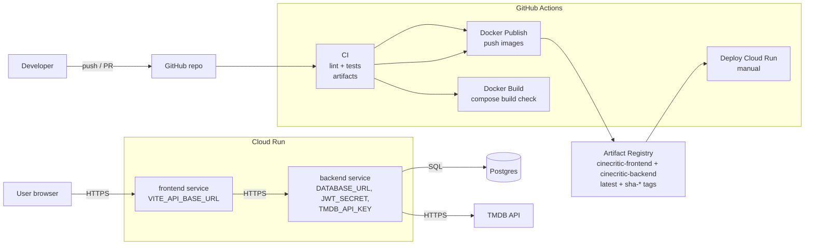

<p align="center">
  
</p>

# CineCritic

**CineCritic** is a movie discovery and review platform: a React (Vite) frontend, a Node.js (Express) API, and PostgreSQL. TMDB powers movie metadata; the app stores users, reviews, watchlists, and favourites in Postgres.

This repository is the **canonical full-stack project**: `frontend/`, `backend/`, and Docker Compose live together. Earlier coursework used **separate** frontend and backend repos; this monorepo is the **definitive** version for local runs, CI/CD, and cloud deployment. **Docker Compose** is the supported way to run the whole stack on your machine.

## Contents

- [What’s in this repo](#whats-in-this-repo)
- [Features](#features)
- [Repositories and deployed apps](#repositories-and-deployed-apps)
- [Prerequisites](#prerequisites)
- [Hardware requirements](#hardware-requirements)
- [Quick start (Docker)](#quick-start-docker)
- [Local URLs](#local-urls)
- [Environment variables](#environment-variables)
- [Useful commands](#useful-commands)
- [Database seed](#database-seed)
- [Running without Docker](#running-without-docker)
- [DevOps, CI/CD, and Google Cloud](#devops-cicd-and-google-cloud)
- [Architecture](#architecture)
- [Technology choices](#technology-choices)
- [Data source](#data-source)
- [Licensing notes](#licensing-notes)

## What’s in this repo

| Path | Role |
| --- | --- |
| `frontend/` | React + Vite SPA (styled-components, Vitest) |
| `backend/` | Express REST API, JWT auth, Swagger at `/docs`, Jest tests |
| `docker-compose.yml` | Orchestrates frontend, backend, and Postgres |
| `.github/workflows/` | CI, Docker build, image publish, Cloud Run deploy |

Code style follows the **Google JavaScript Style Guide**, with ESLint and Prettier in both packages. For dependency tables and day-to-day commands per package, see **`frontend/README.md`** and **`backend/README.md`**.

## Features

- **Discovery:** trending, top-rated, search, advanced search, genres (via TMDB through the API).
- **Reviews:** create, read, update, and delete reviews tied to movies and users.
- **Accounts:** sign up, log in (JWT), profile and user management (see API docs for admin vs self).
- **Lists:** watchlist and favourites per user.

Full route and request details are in **Swagger** (`/docs` when the API is running) and in **`backend/README.md`**—this file does not duplicate every endpoint.

## Repositories and deployed apps

| | URL |
| --- | --- |
| **This monorepo** | https://github.com/vetematts/CineCritic-docker |
| Frontend (historical split repo) | https://github.com/vetematts/CineCritic-frontend |
| Backend (historical split repo) | https://github.com/vetematts/CineCritic-backend |

**Public deployments** (may differ from this repo’s pinned versions):

| | URL |
| --- | --- |
| Web app | https://cinecritic.app |
| API (example) | https://cinecritic.onrender.com |
| API docs (example) | https://cinecritic.onrender.com/docs |

## Prerequisites

- **Docker Desktop** (or Docker Engine + Compose v2)
- **Git**

```bash
docker --version
docker compose version
```

## Hardware requirements

- **CPU:** modern dual-core or better
- **RAM:** 4 GB minimum (8 GB recommended for frontend + API + Postgres)
- **Disk:** ~1 GB for images plus database volume growth

## Quick start (Docker)

1. **Clone**

   ```bash
   git clone https://github.com/vetematts/CineCritic-docker.git
   cd CineCritic-docker
   ```

2. **Environment**

   ```bash
   cp .env.example .env
   ```

   Set at least **`TMDB_API_KEY`**, **`JWT_SECRET`**, and **`POSTGRES_PASSWORD`** (and align **`DATABASE_URL`** with your Postgres user/password if you change them).

3. **Run**

   ```bash
   docker compose up --build -d
   ```

4. **Optional:** seed demo data (after containers are healthy)

   ```bash
   docker compose run --rm backend npm run seed
   ```

   Seeded logins are documented in **`backend/README.md`**.

## Local URLs

| Service | URL |
| --- | --- |
| Frontend | http://localhost:5173 |
| Backend API | http://localhost:4000 |
| Swagger UI | http://localhost:4000/docs |
| PostgreSQL | localhost:5432 |

## Environment variables

Compose reads the **root** `.env`. Copy from `.env.example` and adjust.

| Variable | Purpose |
| --- | --- |
| `VITE_API_BASE_URL` | Browser → API URL (default `http://localhost:4000`) |
| `DATABASE_URL` | Postgres connection string (Compose uses host `db`) |
| `POSTGRES_DB`, `POSTGRES_USER`, `POSTGRES_PASSWORD` | Database bootstrap |
| `JWT_SECRET` | JWT signing |
| `TMDB_API_KEY` | TMDB API (server-side only) |
| `DATABASE_SSL` | Use `false` locally; set appropriately in production |

`frontend/.env.example` and `backend/.env.example` document package-specific copies if you run tools outside Docker.

## Useful commands

| Command | Purpose |
| --- | --- |
| `docker compose up -d` | Start stack |
| `docker compose up --build -d` | Rebuild images and start |
| `docker compose down` | Stop and remove containers |
| `docker compose logs -f` | Follow logs |
| `docker compose ps` | Service status |

## Database seed

One-off seed (does not run on image build):

```bash
docker compose run --rm backend npm run seed
```

## Running without Docker

To run **only** the API or **only** the UI on the host with `npm`, follow **`backend/README.md`** and **`frontend/README.md`** (install, `.env`, and scripts). You will need a local Postgres instance for the API.

---

## DevOps, CI/CD, and Google Cloud

Automation uses **GitHub Actions**: lint and test the apps, verify Docker builds, push images to **Google Artifact Registry**, and deploy to **Google Cloud Run**. The goal is repeatable builds, stored artefacts, and a cloud deployment path without running your own servers.

### Deployment architecture (high level)



### Tools used

| Tool | Role in this project |
| --- | --- |
| GitHub Actions | CI, publish, deploy orchestration |
| Docker + Compose | Local stack; same images CI builds |
| Google Artifact Registry | Versioned Docker images (`sha-*`, `latest`) |
| Google Cloud Run | Managed containers, HTTPS, revisions |
| GitHub Secrets / Environments | Credentials and deploy-time configuration |

**Why this stack (short):** GitHub Actions is native to the repo and keeps logs and artefacts in one place. Artifact Registry and Cloud Run stay inside GCP, so IAM and deployment stay coherent. Alternatives include GitLab CI, Jenkins, GHCR + another host, or GKE (more operations overhead than this project needs).

### Workflows (`.github/workflows/`)

1. **`ci.yml` — Continuous integration**

   **Triggers:** push and pull request to `main` / `master`, `workflow_dispatch`, and a **weekly schedule** (cron in UTC; see workflow file for local-time comment).

   **What it does:**
   - Installs dependencies for `frontend/` and `backend/` (with a shared local composite action for DRY setup).
   - Runs lint + tests for both packages.
   - Uploads artifacts:
     - `ci-test-logs` (stdout logs for lint + test)
     - `backend-test-results` (JUnit XML: `backend/test-results.xml`)

2. **`docker-build.yml` — Image build check**

   **Triggers:** push, pull request, `workflow_dispatch`.

   **What it does:**
   - Runs `docker compose build` on a clean Linux runner (build validation, no containers started).
   - Uses placeholder env values so pull requests do not require secrets.
   - Uploads `docker-build-logs` (compose build output + image list).

3. **`docker-publish.yml` — Publish images**

   **Triggers:** after **`CI`** completes successfully on `main` / `master` (`workflow_run`), or **manual** `workflow_dispatch`.

   **What it does:**
   - Builds and pushes `cinecritic-frontend` and `cinecritic-backend` images to Artifact Registry.
   - Tags images as:
     - `sha-<short>` (traceable to a commit)
     - `latest` (convenience)

4. **`deploy-cloud-run.yml` — Deploy**

   **Trigger:** **`workflow_dispatch` only** (manual).

   **What it does:**
   - Deploys the backend image tag to Cloud Run and injects runtime env values.
   - Captures the backend URL and sets `VITE_API_BASE_URL` when deploying the frontend service.
   - Captures Cloud Run revision names and uploads a `deployment-summary` artifact.

### GitHub secrets (typical)

Set under **Settings → Secrets and variables → Actions** (and use **Environments** for production if you want approvals).

| Secret | Used for |
| --- | --- |
| `GCP_SA_KEY` | JSON key for GCP (publish + deploy) |
| `GCP_PROJECT_ID` | GCP project |
| `GCP_ARTIFACT_REGISTRY_REGION` | Artifact Registry region |
| `GCP_ARTIFACT_REGISTRY_REPOSITORY` | Repository name |
| `RUN_DATABASE_URL` | Production Postgres URL (deploy) |
| `RUN_JWT_SECRET` | Production JWT secret (deploy) |
| `RUN_TMDB_API_KEY` | Production TMDB key (deploy) |

Do **not** commit real secrets. Local development uses `.env`; CI build jobs use placeholders where noted above.

### Deployment flow (summary)

1. Merge to `main` → CI passes → **Docker Publish** can push images.
2. Run **Deploy Cloud Run** manually when you want a release: pick environment, region, and image tag.
3. Backend URL is captured for the frontend build-time API base URL.

### Example: deploy a specific build

- Find an image tag in Artifact Registry (for example `sha-1a2b3c4`).
- Run **Deploy Cloud Run** and set:
  - `gcp_region`: `australia-southeast1` (or your region)
  - `image_tag`: `sha-1a2b3c4`

After the run, download the `deployment-summary` artifact from the workflow run to keep a record of the deployed revisions and backend URL.

### First-time Cloud Run setup

1. **Publish images** — Run **Docker Publish** (or trigger it via CI on `main`) so `cinecritic-frontend` and `cinecritic-backend` exist in Artifact Registry with `latest` and `sha-*` tags.
2. **GCP access** — Create a service account that can push to Artifact Registry and deploy to Cloud Run. Add its JSON key to GitHub as **`GCP_SA_KEY`**. Add **`GCP_PROJECT_ID`**, **`GCP_ARTIFACT_REGISTRY_REGION`**, and **`GCP_ARTIFACT_REGISTRY_REPOSITORY`**.
3. **Runtime secrets** — Add **`RUN_DATABASE_URL`**, **`RUN_JWT_SECRET`**, and **`RUN_TMDB_API_KEY`** for production (not necessarily the same values as local `.env`).
4. **Environment (optional)** — Create a GitHub Environment (e.g. `production`) if you want approvals or environment-scoped secrets.
5. **Deploy** — **Actions → Deploy Cloud Run → Run workflow**: choose the GitHub Environment, GCP region, and image tag (often `latest` or `sha-…`).

The workflow sets **`VITE_API_BASE_URL`** on the frontend service to the deployed backend URL after the backend deploy step. If `DATABASE_URL` contains characters that break `gcloud --set-env-vars`, use **Secret Manager** and `--set-secrets` instead, and adjust the workflow.

### Evidence (CI/CD screenshots)

It can help to keep a few captures of: green workflow runs, artefact downloads (test logs / optional JUnit XML), Artifact Registry tags, and Cloud Run services/revisions.

If you choose to include images in-repo, store them under **`docs/screenshots/`** and reference them from this README (optional).

---

## Architecture

In the default Docker setup, the browser talks to the **frontend**; the frontend calls the **backend** using `VITE_API_BASE_URL`. The backend uses **Postgres** on the Compose network and calls **TMDB** over HTTPS.


---

## Technology choices

| Layer | Choice | Role |
| --- | --- | --- |
| UI | React, Vite, styled-components | SPA, fast dev/build, component styling |
| API | Express, Zod, JWT | REST API, validation, auth |
| Data | PostgreSQL | Users, reviews, watchlist, favourites |
| External API | TMDB | Movie metadata (attribution below) |
| Local ops | Docker Compose | One command to run all services |
| CI/CD | GitHub Actions + Artifact Registry + Cloud Run | Test, build, publish, deploy |

**Alternatives (high level):** Fastify/Nest instead of Express; MySQL/Mongo instead of Postgres for different data models; Vercel/Netlify + separate API host instead of Cloud Run; Kubernetes instead of Cloud Run (more moving parts).

---

## Data source

This product uses the **TMDB API** but is not endorsed or certified by TMDB.
Documentation: https://developer.themoviedb.org/docs

---

## Licensing notes

Dependencies are open source under permissive licenses (MIT/ISC/BSD, etc.). See each package’s page on npm for details.
